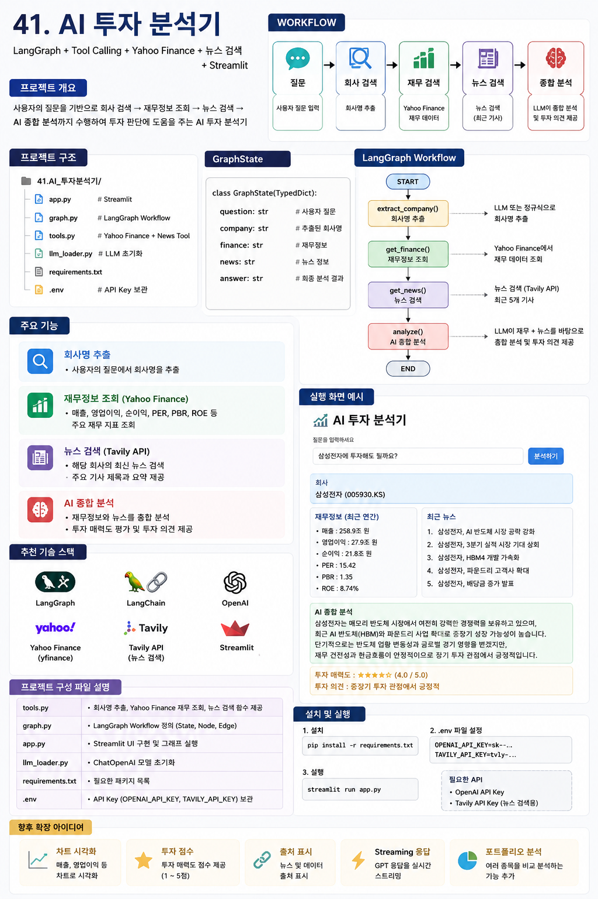

41.AI_투자분석기

│
├── app.py              # Streamlit
├── graph.py            # LangGraph
├── tools.py            # Tool 함수
├── llm_loader.py
├── requirements.txt

            START
              │
              ▼
        회사명 추출
              │
              ▼
        재무정보 조회
              │
              ▼
         뉴스 검색
              │
              ▼
        AI 종합분석
              │
              ▼
             END

강의에서는 다음 기술들을 모두 경험하게 됩니다.

최신 LangGraph
StateGraph
Node
Edge
Tool 함수
Yahoo Finance
뉴스 검색
ChatOpenAI
Streamlit

